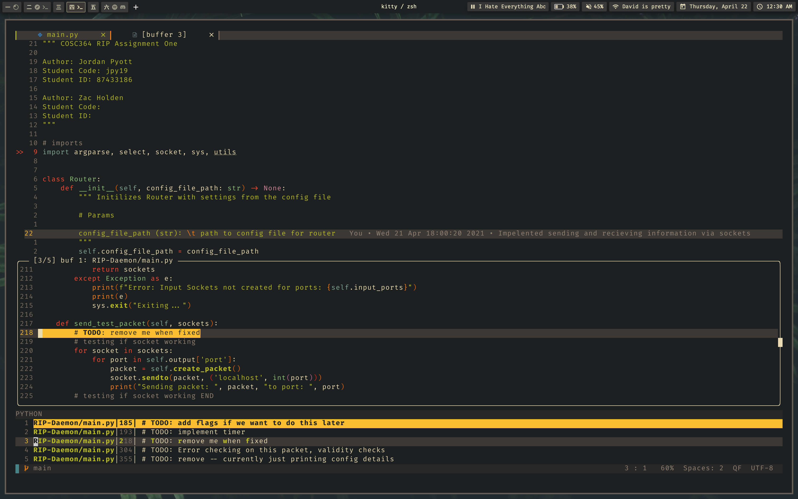

# Todo.vim

### About

A todo manager to streamline TODO's in your code base

This is a basic todo plugin that aims to bring over the IDE experience of handling TODO comments from IDE's like InteliJ
It works by using quickfix lists to pull the TODO's and FIXME's from any file and present it with a user friendly UI.



### Usage

To use this plug-in you will first need to install it with your plug-in manager of choice

For Plug or Dein

```vim
Plug 'atidyshirt/Todo.vim'
call dein#add('atidyshirt/Todo.vim')
```

Then you can simply call it from the command line with `:Todo`

To map it to a key put something like this in your `~/.vimrc` or `~/.config/nvim/init.vim`

```vim
nmap <leader>T :Todo<CR> 
```
